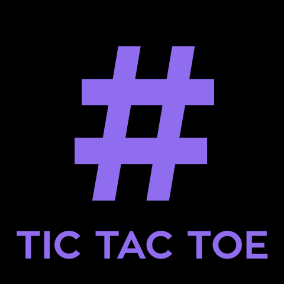

# tic tac toe
This project is served by github pages. https://celsofabri.github.io/tic-tac-toe/



## :space_invader: About
The Tic Tac Toe project was to create a simple game using just HTML, CSS, and JavaScript to build.
The inspiration was to explore one simple solution using more CSS than JS to apply UI rules in the game.
This project is just an experiment of study.

## :pencil2: Contributing?
Yes, you can contributing :) But follow the steps below:

- Fork this project;
- Create a new branch in project local;
- Do your proposal;
- Open a PR to this project;
- Wait for the review.

##  :hammer: To Do
I wanna improve this project in the future. Some ideias are:

- [ ] Add user score;
- [ ] Add player names before of the game;
- [ ] Add option to choice avatar game;
- [ ] Create animations.

## :computer: Developing

```
# install dependencies
npm i
# or yarn

# run the project at localhost:9000
npm start
# or yarn start
```
